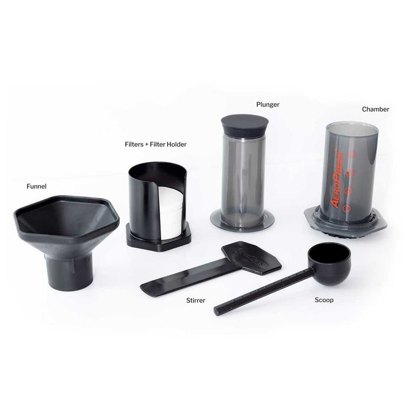
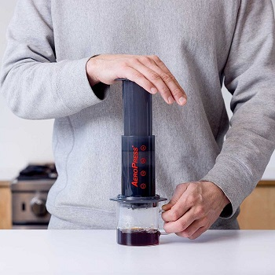
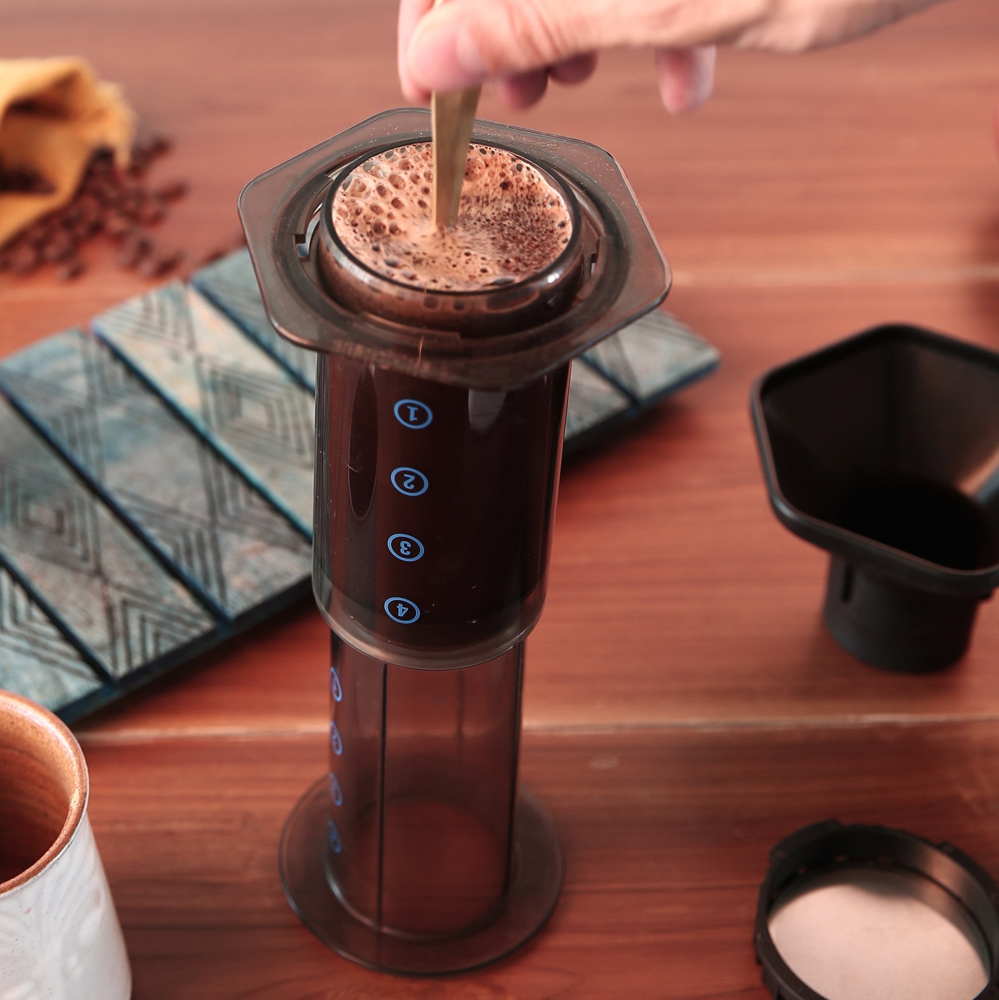

## Persona

Persona is a 27 year old male. He works as a Recruitment Specialist in a corporation that hires 3000 people. He enjoys sport.  After his trip to Brasil he got an interest in different types of coffee and ways of brewing. He wants to try out new ways of making a coffee. 

Experience with coffee making - 2/5 

Coffee types knowledge - 2/5

Documentation use - 3/5

Confidence - 4/5

Stress Level - 4/5

# How to make a coffee with AeroPress
## Table of contents

  - [**1. Introduction**](#1-introduction)
  - [**2. How to brew a coffee in AeroPress**](#2-how-to-brew-a-coffee-in-aeropress)
    - [**What to prepare**](#what-to-prepare)
    - [**Normal vs. Inverted AeroPress**](#normal-vs-inverted-aeropress)
    - [**Brewing**](#brewing)
    - [**Cleaning**](#cleaning)
  - [**3. Playing with a flavor**](#3-playing-with-a-flavor)
  - [**3. Safety notices**](#3-safety-notices)
  - [**4. Glossary**](#4-glossary)

 

## **1. Introduction**

AeroPress is a manual coffee maker that can be used by anyone to make a coffee like a professional. This guide will help you to make first steps in manual coffee making in order to make your perfect coffee. After you master basics, this guide will also provide you tips thanks to which you can exeriment and  achieve excellence in coffee making.

Thanks to AeroPress you can create a great quantity of tastes. This device is small enough for you to take it anywhere and enjoy your daily ritual wherever you are.

## **2. How to brew a coffee in AeroPress**

### **What to prepare**

AeroPress parts:
- Plunger
- Chamber
- Filers and Filter Holder
- Funnel
- Stirrer
- Scoop

Other things you need: 
 - Coffee beans 
- Coffee grinder 
- Scales 
- Hot water

### **Normal vs. Inverted AeroPress** 
You can prepare a coffee in AeroPress in two ways.

**Normal/Upright** 

If you are a beginner, start with this method. This is the original way of how you can brew a coffee.
- Attach the Filter Cap to the Chamber
- Put the AeroPress on the cup with the Filter Cap end directed downwards
- Add a coffee and water according to the recipe
- When the brewing is complete, attach the Plunger and press it to instill the coffee into the cup

When you pour water it starts to drip through the filter immediately, which can cause less extraction of the coffee.

This method can be used when you are a new user of the AeroPress. It is slightly easier and safer to the beginners than the Inverted method.

**Inverted**

- Join the Chamber and the Plunger together
- Set the rubber end of the Plunger on number 4 on the Chamber scale
- Put the AeroPress on a flat surface with the Filter Cap end directed upwards
- Add a coffee and water according to the recipe
- After a stirring attach the Filter Cap with filters to the Chamber
- When the brewing is complete flip the AeroPress, put it on the cup with a Filter Cap end directed downwards and press it to instill the coffee into the cup

This method allows you to brew a coffee for as long as you want because the coffee doesn't drip through the filter while brewing. When you flip the AeroPress, the grinds become fully saturated. For the safety reasons be careful when you flip the AeroPress. Please see  [Safety notices](##Safety-notices) 

### **Brewing**
This instruction is for the **Inverted AeroPress** method
1. Measure 15 grams of coffee
2. Grind coffee beans fine or coarse, depending on what flavor you want to get (refer to playing with flavor section)
3. Put 2 paper filters into the Filter Holder
4. Wet the paper filters
5. Put a scoop of coffee into AeroPress
6. Pour 85-90 grams of hot water (95 degrees) 
7. Stir a coffee for 10 seconds
8. Wait 30 seconds
9. Flip Aerpress and put it on the cup
10. Press gently for 20-45 seconds untill you hear a hissing sound. Your coffee concentate is ready. Add hot water based on your preferences

You can visit [World AeroPress Championship](https://aeropress.com/pages/wac-recipes) website to find more recipes.
### **Cleaning**

Cleaning AeroPress couldn't be easier. You need to press the Plunger all the way and the coffee grounds will drop. After it is done you can just brush AeroPress under the running water. From time to time you can wash it with a dish soap.

## **3. Playing with a flavor**

With AeroPress you can produce numerous flavors of your coffee. The taste of the coffee depends on the *coffee grind, water temperature, extraction time, agitation, and amount of coffee used*. The taste of your coffee can differ in extraction - can be more bitter or more acid. Less extraction means the taste has more acidity, while more extraction means it tastes more bitter. The best way to find your favorite taste is to experiment. Below you see that the taste changes depending on the given factors. The guide does not provide the exact range for these factors as it depends on your judgement.

|            | Less extraction | More extraction |
|------------|----|-----------------|
| Grinding |	coarse	      | fine             |
|Temperature |	lower		|		 	higher|
|Stirring	|gentle			|		strong				
Extraction time |	shorter	|				longer
Coffee amount|	more coffee	|			less coffee

## **3. Safety notices**

Make sure the Filer Cap is strongly attached to the Chamber to prevent it from dropping out. 

In Inverted AeroPress make sure the Plunger is attached to the Chamber before pouring a hot water.

In Normal AeroPress make sure a Filter Cap is attached to the Chamber before pouring a hot water.

When you flip the AeroPress hold the Chamber with one hand and the Plunger with the other hand to prevent them from splitting caused by air pressure. When the AeroPress is on the cup hold the cup with one hand and the AeroPress with another.

Never press hard. It can result in a breakage and spills.

## **4. Glossary**

**Agitation** - brisk stirring or disturbance of a liquid

**Brewing** - The process of extracting the soluble material in roasted and ground coffee. As this coffee is brewed in hot water, hundreds of unique compounds are extracted from the ground beans – creating brewed coffee

**Chamber** - a tube where you add a coffee and water

**Coarse grind** - lumpy grind size 

**Coffee grinder** - a small machine for grinding roasted coffee beans

**Filers** - paper which is used as the porous medium in a filter

**Filter Cap** - round plastic with wholes where you add paper filters through which the coffee drips to the cup 

**Fine grind** -  small grind which you will obtain by grinding coffee for a longer time

**Funnel** - a tube or pipe that is wide at the top and narrow at the bottom, used for guiding liquid a small opening.

**Plunger** - a tube with a rubber on one end which makes a resistance while pressing it when it is attached together with a Chamber

